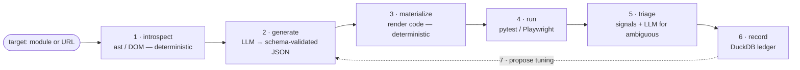
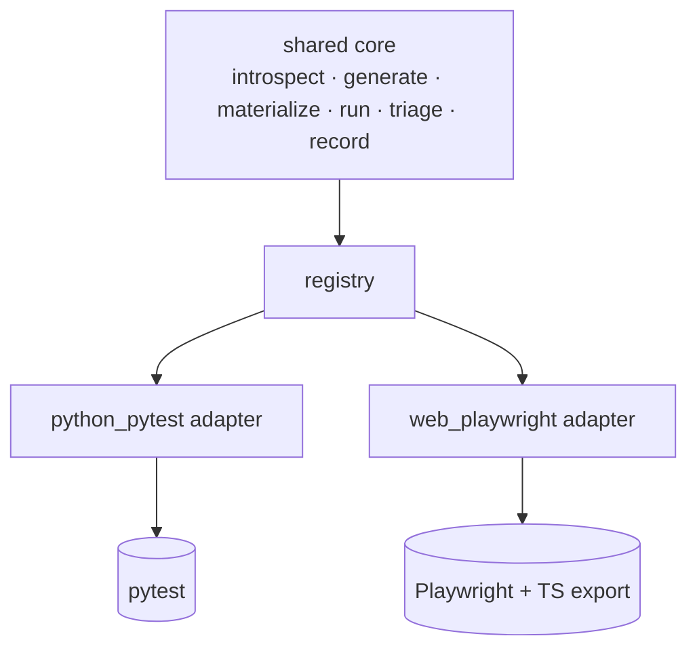

# AI Test Pilot

> An LLM-driven test generator with a shared core and pluggable adapters: point it at a Python
> module or a web page, and it introspects the target, proposes test scenarios as schema-validated
> JSON, renders them into runnable tests, runs them, and triages the failures.


[](https://github.com/Drzymek92/ai-test-pilot/actions/workflows/ci.yml)

## Overview

Most "AI writes your tests" tools let the model emit test *code* directly — which hallucinates
imports, fabricates inputs, and asserts wrong things. AI Test Pilot takes the opposite stance: the
LLM only ever returns **structured, schema-validated JSON** describing a scenario; every line of
runnable code is rendered **deterministically** from that JSON. The LLM is used for the two
genuinely fuzzy steps — *proposing* scenarios and *judging* ambiguous failures — and nothing else.

The same engine drives two target types through one **adapter seam**, so adding a new kind of
target is a single new file with zero changes to the core:

- **`python_pytest`** — points at a Python module, generates `pytest` tests.
- **`web_playwright`** — points at a web page, generates Playwright end-to-end tests (and exports
  idiomatic TypeScript alongside the runnable Python). In *served mode* it goes deeper: a `base_url`
  + `auth_state` fixture pair (real `storage_state` reuse), `page.route` network interception,
  `page.route_web_socket` WebSocket mocking, and an `async_playwright` variant.

## Features

- **Structured-output pipeline** — the LLM returns JSON validated against a Pydantic schema (with a
  one-shot repair retry); code is generated from the validated objects, never written by the model.
- **Typed-input construction** — recursively resolves a function's parameter *types* from source
  (dataclass + Pydantic, nested, `Decimal`/`datetime`/`Enum`, defaults) via `ast` — **without
  importing the target** — and builds real constructor calls. Lets it test domain/OO code, not just
  functions taking primitives.
- **Characterization (golden) mode** — runs each call once and locks the assertion to the real
  result, turning a generated test into a regression guard. Guarded against time-bombs: it
  double-runs and skips any clock/RNG-reading unit whose time isn't pinned.
- **File & fixture inputs** — creates real temp files for file-processing functions, and can
  optionally seed inputs from a companion [synthetic data factory](https://github.com/Drzymek92/synthetic-data-factory).
- **Failure triage** — a deterministic signal table classifies most failures for free
  (`bad_scenario` / `env_issue` / a broken golden lock → `real_bug`); the LLM is called only for the
  genuinely ambiguous ones.
- **Advanced Playwright (served web mode)** — fixtures (`base_url`, `auth_state`), authenticated
  sessions via saved `storage_state`, network interception (`page.route`) to stub APIs
  deterministically, in-process WebSocket mocking (`page.route_web_socket`, server-push + echo), and
  an `async_playwright` variant. Each is just structured JSON the LLM emits — no Playwright code from
  the model.
- **Self-tracking ledger + self-improving tuning** — every run is recorded to DuckDB; `accept`
  backfills how many tests you kept. The tool then proposes the best prompt version *and* (in `auto`
  mode) injects your previously-accepted scenarios for the same target as few-shot exemplars — closing
  the loop with **zero extra LLM calls**.
- **Draft → suite workflow** — `discover` scans a project and prints ready-to-run commands per module;
  `promote` strips a draft's boilerplate, rewrites golden locks into value assertions, and appends only
  the non-duplicate tests into an existing suite. Both deterministic, zero-token.
- **MCP server** — exposes the engine as tools (`introspect`, `generate_tests`, `triage_failures`,
  `run_metrics`, `accept_run`) so it's callable from any MCP client.

## How it works



Stages 1, 3, 4, 6 cost **zero tokens**. Stage 2 is one batched LLM call; stage 5 calls the LLM only
for failures the deterministic signal table can't classify. The core never imports an adapter
directly — only through a name registry — which is what keeps the two target types fully decoupled:



## Demo — sample run

```text
$ python scripts/main.py --target path/to/rules/commission.py --selector compute_commission --golden

introspected 1 unit(s); resolved types: OrderView, LineItemView, RulesConfig, CommissionRules
generated 5 scenario(s)
golden mode: locked 5 characterization assertion(s)
run complete: 5/5 passed

✓ 5 passed · 0 failed · 0 error / 5 generated
  tests:  scripts/outputs/tests/test_commission_<ts>.py
  report: scripts/outputs/reports/report_<ts>.md
```

A generated test constructs the real typed inputs and locks the computed result:

```python
def test_standard_commission():
    """Commission for a multi-item order."""
    result = compute_commission(
        order=OrderView(currency="PLN", status="DELIVERED", line_items=[
            LineItemView(category="electronics", unit_amount=Decimal("100.00"), quantity=2)]),
        config=RulesConfig())
    assert repr(result) == ("CommissionBreakdown(currency='PLN', "
        "items_commission=Decimal('4.00'), transaction_fee=Decimal('1.00'), "
        "total_commission=Decimal('5.00'), rule_version='v1')")
```

For the `web_playwright` adapter, the same pipeline produces self-contained Playwright tests and an
idiomatic `.spec.ts` export. Three sample targets are included: `demo/signup.html` (simple form),
`demo/login_app/` (served — auth/`storage_state` + API interception), and `demo/ws_app/` (served —
WebSocket push/echo). The served demos are run with `--serve`:

```bash
# deep web: emits base_url + auth_state fixtures, page.route interception, async variant
python scripts/main.py --adapter web_playwright --target demo/login_app/index.html --serve

# websocket: emits page.route_web_socket mock (server push + echo) + expect_ws_message
python scripts/main.py --adapter web_playwright --target demo/ws_app/index.html --serve
```

## Tech Stack

- **Language:** Python 3.10+
- **Core:** `pydantic` (the schema spine), `jinja2` (pytest emission), `duckdb` (the run ledger)
- **LLM:** `langchain-openai` against any OpenAI-compatible gateway (`LLM_BASE_URL`/`LLM_MODEL`/`LLM_API_KEY`)
- **Adapters:** `pytest` (python target runner), `playwright` (web — bundles its own driver, no Node needed)
- **Integration:** `mcp` (FastMCP) — exposes the engine over the Model Context Protocol

## Getting Started

### Prerequisites
- Python 3.10+ on PATH

### Installation
```bash
git clone https://github.com/Drzymek92/ai-test-pilot.git
cd ai-test-pilot
python -m venv .venv
.venv\Scripts\activate          # Windows  (source .venv/bin/activate on macOS/Linux)
pip install -r requirements.txt
cp config/.env.example config/.env     # then fill in your LLM gateway values
# for the web adapter only:
python -m playwright install chromium
```

### Usage
```bash
# generate pytest tests for selected functions
python scripts/main.py --target path/to/module.py --selector func_a,func_b

# lock assertions to real results (characterization / regression mode)
python scripts/main.py --target path/to/module.py --golden

# generate Playwright tests for a web page
python scripts/main.py --adapter web_playwright --target path/to/page.html

# record how many proposed tests you kept (feeds tuning)
python scripts/main.py accept <run_id> --kept 4

# scan a project for testable targets (deterministic, no LLM)
python scripts/main.py discover path/to/project

# clean a draft for the suite: strip boilerplate, rewrite golden locks, append non-duplicates
python scripts/main.py promote <run_id> --into tests/test_module.py
```

Run as an **MCP server** (callable from any MCP client) — register it with:
```json
{ "command": "python", "args": ["/path/to/ai-test-pilot/scripts/mcp_server.py"] }
```

## Project Structure
```
scripts/
  main.py               # CLI + run_pipeline() (the one pipeline every interface reuses)
  mcp_server.py         # MCP server (FastMCP) exposing the engine as tools
  core/                 # adapter-agnostic engine: models, generate, materialize, runner, triage,
                        #   ledger, tuning, context, fixtures, registry, discover, promote
  adapters/             # python_pytest · web_playwright  (one file per target type)
  prompts/              # scenario-generation prompts + the pytest Jinja template
config/                 # ai_test_pilot.toml (defaults) + .env.example
demo/                   # signup.html · login_app/ (auth) · ws_app/ (websocket) — web adapter targets
tests/                  # 89 unit tests
```

## Design notes

- **Determinism first.** Introspection, code emission, running, the triage signal table, and the
  ledger are all plain code. The LLM is a tool for the two irreducibly fuzzy steps only.
- **Never imports the target.** Introspection is `ast`-only, so a target's heavy/optional
  dependencies are never triggered to generate tests for it.
- **Human-in-the-loop.** Generated tests are *proposed* into `scripts/outputs/` — never written into
  a target repository. Promoting them is a separate, explicit step.

Validated end-to-end across a typed business-rules engine, pure data-transformation helpers, a web
form, an authenticated app with API interception, and a WebSocket feed — producing runnable,
correctly-typed, regression-grade tests in each case.

> **CI note:** the published CI runs the full unit suite, which is browser-free by design — the
> `web_playwright` tests assert on the *generated test source*, not a live browser. The `--serve`
> demos are run locally (after `playwright install chromium`); CI doesn't download a browser.

## License

Licensed under the MIT License — see [LICENSE](LICENSE).
